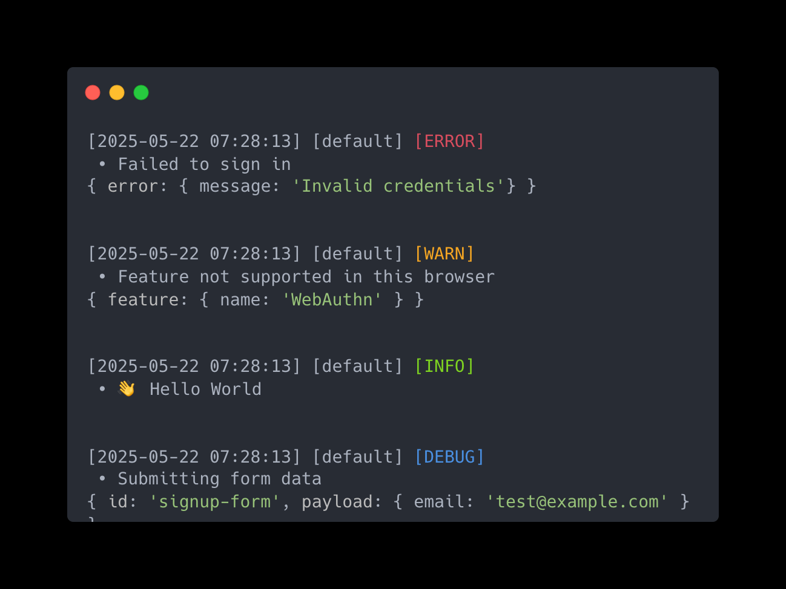
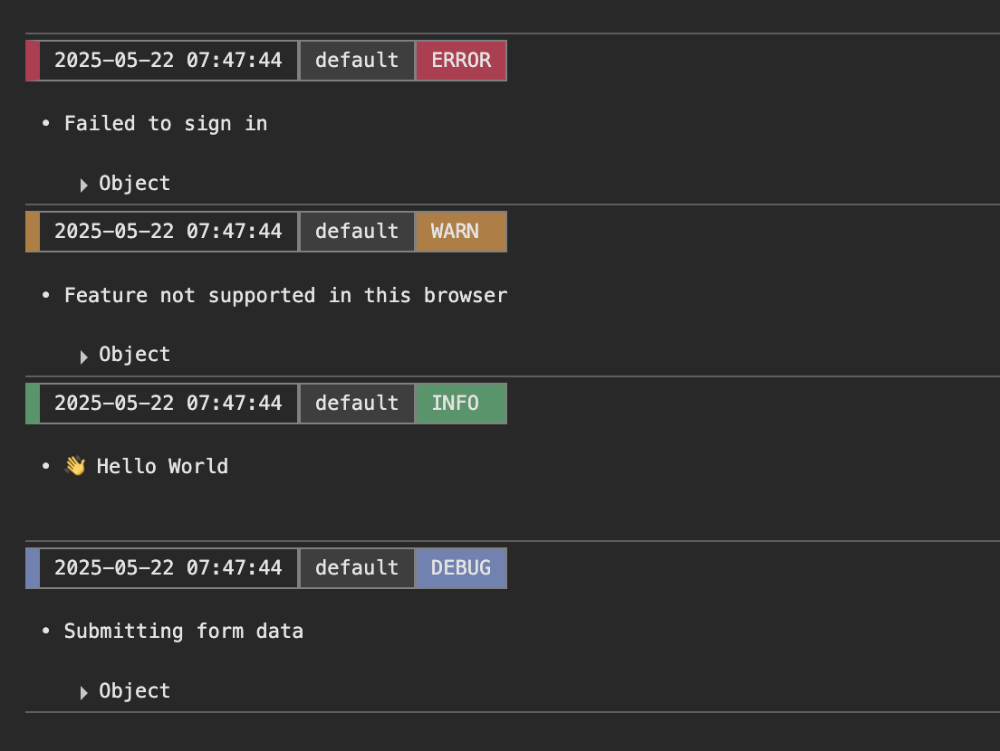

<p align="center">
  <!--  -->
</p>

<h1 align="center">Logry</h1>

<div align="center">

A clean, lightweight, cross-platform logger that just works — on both Node.js and modern browsers.  
Fully typed, deeply customizable, and built for the monorepo era.

</div>

<div align="center">

[](https://www.npmjs.com/package/logry)
[](https://bundlephobia.com/package/logry)
[](LICENSE)
[](https://www.typescriptlang.org/)

</div>

> Logging in fullstack apps is messy.  
> You jump between server and browser, but most loggers don’t.  
> **Logry** was built for the monorepo era — a single, fully-typed logger that works identically across platforms.

 Use the same logger in SSR, API routes, and client-side code  
 Modular architecture: customize each part (normalize, format, transport)  
 Fully typed, no runtime deps, scoped logging, plugin-ready

---

## 📚 Outline

- [😎 Features at a Glance](#features-at-a-glance)
- [🌟 Output Preview](#output-preview)
- [🚩 Installation](#installation)
- [🚀 Quick Start](#quick-start)
- [🌌 Presets](#presets)
- [☄️ Core Concepts](#core-concepts)
  - [✨ Log Level](#✨-log-level)
  - [✨ Child Loggers](#✨-child-loggers)
  - [✨ Logger Core](#✨-logger-core)
  - [✨ Logger Handlers and Tasks](#✨-logger-handlers-and-tasks)
- [🔀 Normalizer](#normalizer)
- [🎨 Formatter](#formatter)
- [🛫 Transporter](#transporter)
- [🛠️ Devtools](#devtools)
- [🔌 Development Mode Detection](#development-mode-detection)

---

##  Features at a Glance

- **⚡ Zero-dependency & Type-safe — Written in TypeScript with no runtime bloat**
- **🌍 Environment Agnostic — Use the same logger in SSR, API routes, and the browser**
- **🎨 Customizable Output — Control every part of the log format — or write your own**
- **🧠 Context Support — Inject trace data like requestId, userId and pass it down**
- **🪵 Scoped Loggers — Organize output with nested scopes like auth > login > error**
- **🧩 Composable Architecture — Swap in custom normalizers, formatters, and transporters**
- **🛠 Plugin-ready Core — Register your own handlers via a flexible hook system**

---

##  Output Preview

Here’s how logs look in Node.js vs. the browser:

<table width="100%">
  <tr>
    <td align="center" width="50%">
      <br/>
      <em>Console output in Node.js</em>
    </td>
    <td align="center" width="50%">
      <br/>
      <em>Console output in Browser</em>
    </td>
  </tr>
</table>

---

##  Installation

```bash
npm install logry
```

or use **yarn**

```bash
yarn add logry
```

---

##  Quick Start

<h3>Using Static Logger Methods</h3>

The easiest way to use **Logry** is by calling its static logging methods.  
They work instantly without a logger instance, ignore level restrictions, and default to the **“pretty”** preset for clean outpu

```typescript
import { trace, debug, info, warn, error, fatal } from "logry";

info("👋🏼 Hi there! Welcome to Logry!");

// 2nd argument is metadata for additional details
warn("User session is about to expire", { user: "John Doe" });

// Error with full error object
error("Unexpected error occurred", new Error("Something went wrong"));
```

<h3>Creating a Custom Logger Instance</h3>

You can create a logger by calling **logry()**.  
By default, the log level is set to **"warn"**, so only logs with levels **"warn"**, **"error"**, and **"fatal"** will be shown.  
If you don’t specify an ID, the logger will use **"default"** as its identifier automatically.

```typescript
import { logry } from "logry";

// Create a custom logger instance (defaults to id: 'default' and level: 'warn')
const logger = logry();

// ❌ This won't be shown — 'info' is lower than the default 'warn' level
logger.info("User logged in");

// ✅ This will be shown — 'warn' and above are allowed
logger.warn("User login warning");

// Inspect internal core (optional)
console.log(logger.getCore());
// -> LoggerCore { id: 'default', level: 'warn', ... }
```

- Basic Logger Setup for Development

```typeScript
import { logry } from "logry";

const logger = logry({
  id: "MyLogger",
  level: "debug", // Will show: debug, info, warn, error, fatal (trace will be hidden)
});
```

- Full Custom Logger Setup

```typescript
import { logry } from "logry";

const logger = logry({
  id: "🌐 My Logger",
  level: "info",
  scope: ["auth", "api"],
  context: { env: "production", appVersion: "2.5.1" },
  preset: "verbose", // "json" | "pretty" | "pretty-multi-line" | "minimal" | "verbose"
  normalizerConfig: {
    node: {
      timestamp: { style: "iso" },
      // ...
    },
    browser: {
      timestamp: { style: "pretty" },
      // ...
    },
  },
  formatterConfig: {
    node: {
      id: { ansiColor: "\x1b[35m" },
      message: { customFormatter: ({ part }) => "\n" + part.toUpperCase() },
      // ...
    },
    browser: {
      id: { cssStyle: "color: purple;" },
      context: { format: "compact" },
      // ...
    },
  },
  handlerConfig: {
    onError: (error: unknown, handlerId: string) =>
      console.log(handlerId, error),
    // ...
  },
});
```

---

##  Presets

**Logry** offers several built-in logger presets. Each preset is a set of normalizer and formatter settings for different log styles.

| Level               | Description                            |
| ------------------- | -------------------------------------- |
| `json`              | Raw JSON output, good for machines     |
| `pretty`            | Formatted, easy to read                |
| `pretty-multi-line` | Multi-line output with line breaks     |
| `minimal`           | Simple output with essential info only |
| `verbose`           | Full detail with context and depth     |

To use a preset, pass it when creating the logger:

```typeScript
const logger = logry({ preset: "pretty" })
```

Presets are fixed for now.  
🎯 Custom presets may come in future versions.

---

##  Core Concepts

**Logry** is built with modularity, precision, and developer experience in mind.  
Here are the key concepts that define how it works:

### ✨ Log Level

**Logry** supports **seven log levels**, from most critical to most verbose:

| Level    | Description                                                                            |
| -------- | -------------------------------------------------------------------------------------- |
| `fatal`  | Logs critical system failures. The application may crash or exit immediately ❗        |
| `error`  | Logs runtime errors that should be investigated and typically require action ❌        |
| `warn`   | Logs recoverable issues or unexpected behaviors that don't prevent operation ⚠️        |
| `info`   | Logs general operational messages, such as successful startups or actions ℹ️           |
| `debug`  | Logs detailed internal information helpful for debugging 🛠️                            |
| `trace`  | Logs the most granular details — every step, useful for profiling or deep debugging 🔍 |
| `silent` | Disables all logging output 🚫                                                         |

> The logger only outputs messages **at or above the current level**.  
> For example, if the level is set to `warn`, only `warn`, `error`, and `fatal` logs will be printed.

<h4> You can specify the desired log level when creating a logger instance </h4>

but this only affects the initial configuration and does not override the core’s log level.

```typescript
// Initialize a logger with a preferred level (for initial filtering)
const logger = logry({ id: "my-app", level: "debug" });
```

### ✨ Child Loggers

In **Logry**, every logger instance is lightweight and modular.  
You can freely create **child loggers** that inherit settings from their parent — while overriding only what you need.

<h4> Creating a Child Logger </h4>

You can use the `.child()` method to create a scoped or customized logger:

```ts
const appLogger = logry({ id: "main-app", level: "info" });

const authLogger = appLogger.child({
  level: "debug", // override log level
  scope: "auth", // add a scope
  context: { userType: "admin" }, // inject default context
});
```

- Child loggers inherit settings with **shallow merging (first-level only)**:
  - **scope**: appended  
    e.g., **["main"] + "auth"** → **["main", "auth"]**
  - **context**: merged with child overriding  
    e.g., **{ app: "main", user: "guest" } + { user: "admin" }** → **{ app: "main", user: "admin" }**
  - **formatterConfig / normalizerConfig**: shallow merged per platform (**node**, **browser**), with child taking precedence

This keeps child loggers flexible and contextual — without needing to re-specify everything.

### ✨ Logger Core

The core engine responsible for managing log levels, shared identity (id), and optional configurations for formatting, normalization, and handlers.

- Multiple logger instances can share a single core by specifying the same id, enabling centralized and synchronized log level management across instances.
- It supports dynamic runtime control of log verbosity:
  - `setLevel(level)`: updates the active log level
  - `resetLevel()`: restore to the initial log level

This allows flexible adjustment of log output without needing to recreate logger instances.

### ✨ Logger Handlers and Tasks

Each Logger instance internally binds to a HandlerManager, inherited from its LoggerCore.

This module orchestrates all registered log handlers, manages asynchronous tasks, and controls error recovery and flush strategies.

- Handlers are responsible for final log delivery, such as writing to the console, server, or external services.
- You can dynamically attach or remove handlers:
  - `addHandler(handler, id?)`
  - `removeHandler(id)`
- It also ensures all async handlers complete with:
  - `flush(timeout?)`: waits for pending log operations
  - `dispose()`: clean up all resources and cancel strategies

Behind the scenes, HandlerManager tracks pending tasks and gracefully handles errors via configurable callbacks and timeout policies.

This flexible system allows reliable logging — even in asynchronous or failure-prone environments.

---

##  Normalizer

Before any log is formatted or transported, **Logry** runs it through a platform-aware normalizer — ensuring consistent structure, reliable types, and flexible customization

### What it does

The Normalizer transforms a raw log input into a normalized shape, handling core parts like:

- timestamp
- id
- level
- scope
- message
- meta
- context

Each part has a dedicated normalizer, all of which can be overridden via custom logic.

### Customization

Every normalizer supports a customNormalizer function, letting you override default behavior:

```typescript
customNormalizer?: ({ part }) => NormalizedValue;
```

You can also fine-tune behavior using extra options per part.

| Part        | Extra Options Available     |
| ----------- | --------------------------- |
| `timestamp` | style, useUTC, showTimeOnly |
| `level`     | style                       |
| `scope`     | separator                   |
| `meta`      | errorStackLines             |

### Platform Awareness

Normalization logic can vary between Node and Browser environments, adapting behavior accordingly.

For example:

- Timestamps appear as full ISO 8601 UTC strings in Node, but as simplified human-readable strings in the browser.
- Error stack traces can be more verbose on the server, while trimmed on the client.

> You can define environment-specific behavior using the normalizerConfig structure.  
> It can be set globally in **logry(...)**, scoped to a **logger.child(...)**, or **overridden per log method**:

```typeScript
 normalizerConfig: {
    node: {
      timestamp: {
        style: "iso",
        useUTC: true,
      },
      meta: {
        errorStackLines: 10,
      },
      level: {
        style: "upper",
      },
      id: {
        customNormalizer: ({ part }) => `node-${part}`,
      },
    },
    browser: {
      timestamp: {
        style: "pretty",
        useUTC: false,
      },
      meta: {
        errorStackLines: 3,
      },
      level: {
        style: "lower",
      },
    },
  },
```

---

##  Formatter

The Formatter layer is responsible for converting the normalized parts of a log into final output strings — styled, readable, and optionally color-coded.

### What it does

The Formatter receives normalized data and produces formatted strings (or structured content) ready for display.  
Handled parts include:

- timestamp
- id
- level
- scope
- message
- meta
- context
- pid (_Node.js only_)
- hostname (_Node.js only_)

Each part has its own formatter. All formatters support optional style customizations and can be overridden with custom logic.

### Customization

Every formatter supports a customFormatter function, letting you override default behavior:

```typescript
customFormatter?: ({ part, rawPart }) => FormattedValue; // rawPart is not normalized
```

You can also fine-tune behavior using extra options per part.

| Platform  | Part      | Extra Options Available               |
| --------- | --------- | ------------------------------------- |
| `Node.js` | ALL       | ansiColor                             |
| -         | `scope`   | showOnlyLatest, seperator             |
| -         | `meta`    | format, depth (for format: **"raw"**) |
| -         | `context` | format, depth (for format: **"raw"**) |
| `Browser` | ALL       | cssStyle                              |
| -         | `scope`   | showOnlyLatest, seperator             |
| -         | `meta`    | format                                |
| -         | `context` | format                                |

### Platform Awareness

Formatter adapts to the runtime platform — Node.js or Browser — adjusting output format and styling accordingly.  
This ensures logs stay readable and well-styled in both environments.

The output behavior varies depending on the platform:

| Platform  | Format output                                 | Styling mechanism      |
| --------- | --------------------------------------------- | ---------------------- |
| `Node.js` | Returns a plain string with ANSI codes        | Uses ANSI escape codes |
| `Browser` | Returns { [label]: string, cssStyle: string } | Uses %c and inline CSS |

In the browser, the final result will be used with console.log("%c...%c...%c...", styleA, styleB, ...), allowing for per-part CSS styling.

For example:

- Node.js prints timestamps as full ISO strings with ANSI colors (e.g., \x1b[33m).
- Browser styles timestamps with CSS (e.g., orange and bold) and simpler format.
- Meta shows full depth in Node, but gets a prefix like “META | “ in Browser.
- Some parts (like level) can be hidden in one platform but shown in another.

> You can define environment-specific behavior using the formatterConfig structure.  
> It can be set globally in **logry(...)**, scoped to a **logger.child(...)**, or **overridden per log method**:

```typeScript
formatterConfig: {
  node: {
    timestamp: {
      ansiColor: "\x1b[33m",
    },
    meta: {
      depth: null,
    },
    level: {
      lineBreaks: 1,
    },
    id: {
      customFormatter: ({ part }) => `node-${part}`,
    },
  },
  browser: {
    timestamp: {
      cssStyle: "font-weight: bold; color: orange;",
    },
    meta: {
      prefix: "META | ",
    },
    level: {
      hide: true,
    },
  },
},
```

---

##  Transporter

The Transporter is the final step in the logging pipeline — responsible for delivering the formatted log to its destination.  
After a log is normalized and formatted, the Transporter takes over and outputs it — whether that’s the terminal in Node.js, or the DevTools console in a browser.

### Built-in Transporters

Logry comes with two built-in transporters, automatically selected based on your runtime environment:

| Platform  | Transporter               | Styling mechanism                                    |
| --------- | ------------------------- | ---------------------------------------------------- |
| `Node.js` | NodeConsoleTransporter    | Prints logs to the terminal using ANSI styles        |
| `Browser` | BrowserConsoleTransporter | Prints logs to the DevTools console using CSS styles |

These built-ins are designed to be minimal yet effective — providing clean and consistent output across platforms.  
🎯 In future versions, Logry will support custom transporters for advanced use cases like file writing, remote logging, or API-based delivery.

---

##  Devtools

Logry includes small tools to help you debug and inspect logger internals.

#### inspectLoggerCores()

List all registered LoggerCore instances.

```typeScript
import { inspectLoggerCores } from "logry/devtools";

inspectLoggerCores();
```

Helps you verify how loggers are created and linked.

#### inspectHandlerConfig(logger)

Show the resolved handler config for a given logger.

```typeScript
import { inspectHandlerConfig } from "logry/devtools";

inspectHandlerConfig(myLogger);
```

Good for checking which rules and tasks are active.

---

##  Development Mode Detection

This function detects whether the runtime is in development mode.  
 It is primarily used to control internal logging and error reporting within the library, such as internal-log and internal-error messages.

- In `Node.js`, it checks the NODE_ENV environment variable:

  - Returns true if `NODE_ENV` is not set to 'production'.
  - Defaults to true (development) if `NODE_ENV` is undefined.

- In `Browsers`, it checks the global flag `__LOGRY_DEV__`:
  - Returns true if the flag is truthy.
  - Defaults to false (production) if undefined.

This setup assumes Node defaults to development mode for easier local testing, while browsers default to production to avoid unnecessary debug logs.

---
